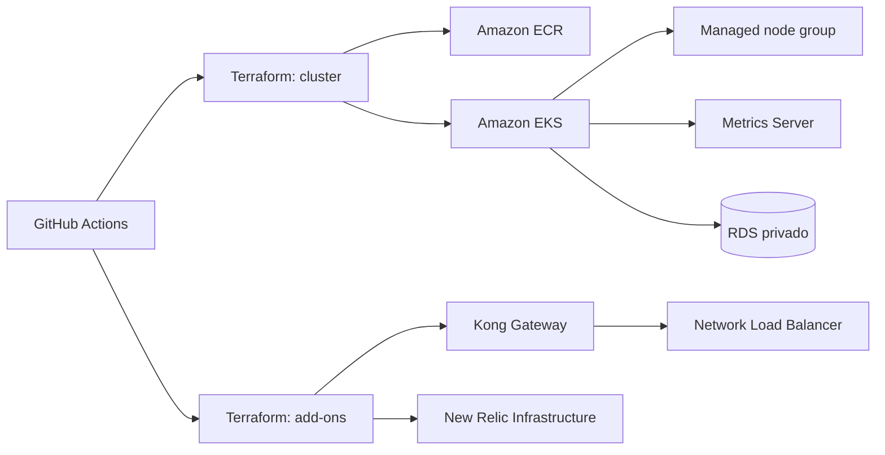

# Infraestrutura Kubernetes da Oficina Mecanica

Este repositorio provisiona a plataforma Kubernetes usada pela aplicacao na AWS:

- cluster Amazon EKS e grupo de nodes gerenciado;
- Amazon ECR para armazenar a imagem Docker da API;
- Metrics Server para alimentar o HPA da aplicacao;
- Kong Gateway e seu Network Load Balancer;
- agente de infraestrutura do New Relic para CPU e memoria do Kubernetes;
- regra de rede que permite ao EKS acessar o RDS privado.

O Terraform foi dividido em duas raizes. `infra/cluster` cria a infraestrutura
AWS; `infra/addons` usa o cluster pronto para instalar componentes via Helm.

## Tecnologias

- Terraform
- Amazon EKS e Amazon ECR
- Kubernetes e Helm
- Kong Gateway
- New Relic Kubernetes integration
- GitHub Actions

Nao existe Dockerfile neste repositorio porque ele provisiona infraestrutura e
add-ons. A imagem da API e criada pelo repositorio da aplicacao principal.

## Arquitetura deste repositorio



## CI/CD

`Integracao continua - Kubernetes` valida formatacao e sintaxe das duas raizes
Terraform em todo Pull Request e push na `main`.

`Entrega continua AWS - Kubernetes` e manual para preservar os creditos do AWS
Academy. Execute-a depois do deploy do repositorio de banco e antes da aplicacao.

Secrets necessarios no GitHub:

- `AWS_ACCESS_KEY_ID`
- `AWS_SECRET_ACCESS_KEY`
- `AWS_SESSION_TOKEN`
- `NEW_RELIC_LICENSE_KEY`

## Validar localmente sem criar recursos

Na raiz do repositorio, execute:

```bash
terraform fmt -check -recursive
terraform -chdir=infra/cluster init -backend=false
terraform -chdir=infra/cluster validate
terraform -chdir=infra/addons init -backend=false
terraform -chdir=infra/addons validate
```

Os comandos apenas baixam os providers e validam as duas raizes Terraform. Nao
executam `plan` ou `apply` e nao consomem recursos do AWS Academy.

## Implantar em producao

1. Conclua primeiro a entrega do repositorio de banco.
2. Atualize os secrets AWS e `NEW_RELIC_LICENSE_KEY` neste repositorio.
3. Confirme que as alteracoes foram integradas na branch `main`.
4. Abra `Actions -> Entrega continua AWS - Kubernetes`.
5. Clique em `Run workflow`, selecione `main` e confirme.
6. Aguarde o Summary exibir cluster, ECR, endpoint do Kong e nome do cluster no
   New Relic.

O workflow cria primeiro EKS, node group, ECR e Metrics Server. Depois configura
`kubectl` e instala Kong e New Relic pela segunda raiz Terraform. Nenhum cadastro
manual e feito no Kong.

## Ordem de deploy

1. Banco
2. Kubernetes
3. Aplicacao
4. Lambda

A destruicao ocorre na ordem inversa. A pipeline deste repositorio bloqueia a
remocao enquanto os states da aplicacao ou da Lambda ainda possuem recursos.

Para remover, execute `Actions -> Destruir infraestrutura AWS - Kubernetes` na
branch `main` e informe `DESTRUIR`, somente depois de destruir Lambda e
aplicacao.

## Swagger

Este repositorio nao expoe uma API propria. O Swagger da aplicacao principal e
publicado pelo Kong, e a URL final aparece no resumo da pipeline da aplicacao:
[repositorio principal](https://github.com/kaziwon/techchallengerm372882).

Diagramas completos, RFCs e ADRs estao no
[`docs/README.md` da aplicacao principal](https://github.com/kaziwon/techchallengerm372882/blob/main/docs/README.md).
